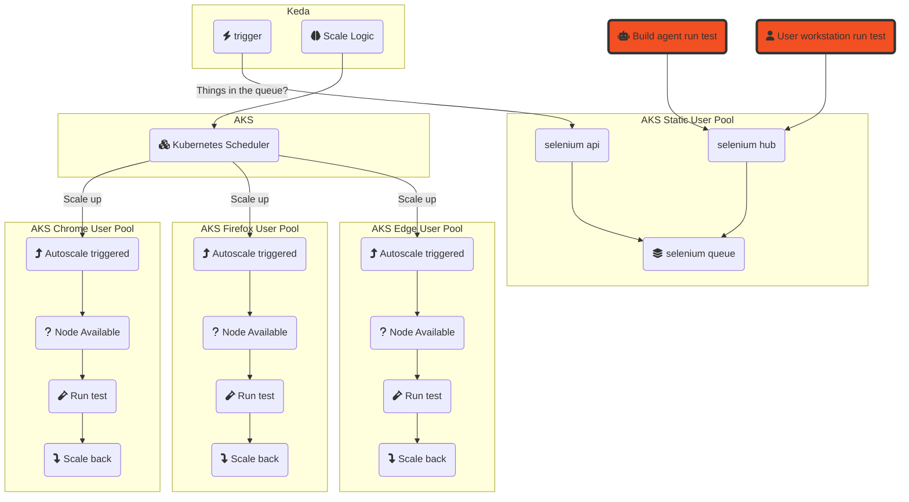
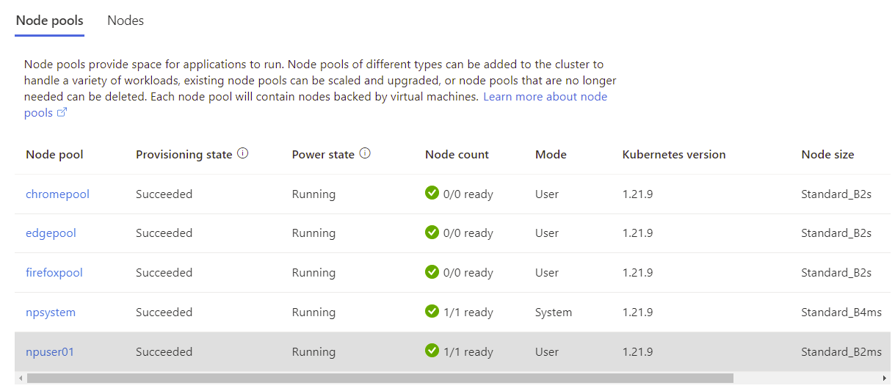

# Selenium Grid scaling with KEDA on AKS

This sample shows how to create an Azure Kubernetes Service optimised to work with [Selenium Grid](https://www.selenium.dev/documentation/grid/) for node autoscaling.
Dedicated browser node pools will scale up from zero instances using KEDA (Kubernetes Event-driven Autoscaling) which monitors the Selenium test queue.

Seperation of the browser node pools isn't strictly essential to this sample, but it does provides;

- Overall faster autoscale out
- Cost visbility through node pool tagging
- The ability to limit specific browser-nodes tests to a lower maximum node pool size
- A showcase for multi-nodepool queue based autoscaling

## Features

This sample shows the following features:

* AKS Configured with multiple node pools, with some `Scaling from Zero`
* Using `Node Selectors` to map AKS node pools to Selenium browser nodes
* Selenium Queue triggered cluster scaling using `Event Driven Autoscaling` with KEDA

## Overview



## Getting Started

### Prerequisites

Interaction with Azure is done using the [Azure CLI](https://docs.microsoft.com/cli/azure/), [Helm](https://helm.sh/docs/intro/install/) and [Kubectl](https://kubernetes.io/docs/tasks/tools/#kubectl) are required for accessing Kubernetes packages and installing them to the cluster.

The [Selenium IDE CLI](https://www.selenium.dev/selenium-ide/docs/en/introduction/command-line-runner) (Selenium Side Runner) is used to add tests to the queue. The side runner is provided as a npm package which requires Node & Npm to be installed.

> A dev container and GitHub action are included in this repo to make this easier for users who don't have all these tools set up locally.

### Installation

#### AKS

Using [AKS Construction](https://github.com/Azure/Aks-Construction), we can quickly set up pair of AKS clusters in different virtual networks with connectivity between.
One cluster will run the Selenium Grid, and the other will run a sample application.

```bash
az deployment sub create -u https://github.com/Azure/AKS-Construction/releases/download/0.9.12/samples-peered-vnet.json -l WestEurope -p adminPrincipalId=$(az ad signed-in-user show --query objectId --out tsv)
az aks get-credentials -n aks-grid-stest -g rg-stest-selenium --overwrite-existing
```

#### Keda

Install Keda into a new Keda namespace.

```bash
helm repo add kedacore https://kedacore.github.io/charts
helm repo update
kubectl create namespace keda
helm install keda kedacore/keda --namespace keda
```
#### Import images into your own ACR

> *Optional*:
By default the helm charts below pull the images from the public Docker Hub registry. If for security reasons you would like to pull them into your own Azure Container Registry and point the Helm chart to your 'local' copy of these images, follow the below steps.


Review the list of images in acrImport.bicep before running the below.
```bash
az deployment group create -f .\acrImport.bicep -g <Resource Group of the ACR> -p acrName=<Your ACR Name>
```

#### Selenium Grid

git clone https://github.com/seleniumhq/docker-selenium.git

# Change directory to the above cloned directory.

Install Selenium Grid in the default Kubernetes namespace.

> *Optional*: If you have pulled the images into your own ACR, you will need to change the helm charts after cloning the repo.

1. Ensure you are in the correct directory, and then navigate to charts/selenium-grid and open values.yaml

2. Change the Image Tag and the NodesImageTag to the tag you have used in your container registry when pulling the images. For the purposes of this example, we have used 'latest'.

3. Then proceed to change all of the 'imageName' values to the image that is contained in your container registry. For example - For router we have set the value to - 'crgridstests4dlypacu24ac.azurecr.io/selenium/router'

The Container Registry name, followed by the repo and then the image tag will be appended from the variable at the top of the file you have already changed.

The next step is to package your newly edited files into a helm chart that you can push into your Azure Container Registry.

````bash

# Set some variables to use in the following commands

ACRNAME="your ACR name"
USER_NAME="00000000-0000-0000-0000-000000000000" #This can be left as the default
PASSWORD=$(az acr login --name $ACRNAME --expose-token --output tsv --query accessToken) #This can be left as the default

# Run the following from the directory that contains the helm charts.

helm package .

# Log in to your registry

az acr login --name $ACRNAME

#Log in to your registry with HELM

helm registry login $ACRNAME --username $USER_NAME --password $PASSWORD

#Push your edited helm chart to your container registry. Please note: the zipped file will have been generated from your helm package in the above step.

helm push selenium-grid-0.15.4.tgz oci://$ACRNAME/helm

#Attach your ACR to your AKS cluster to allow AKS to pull the image.

az aks update -n <AKSClusterName> -g <Resource Group that contains your ACR> --attach-acr <Your ACR Name (Not the FQDN)>

````

```bash

chromeReplicas=0
firefoxReplicas=0
edgeReplicas=0
helm upgrade --install selenium-grid charts/selenium-grid/. --set hub.serviceType=LoadBalancer,chromeNode.replicas=$chromeReplicas,firefoxNode.replicas=$firefoxReplicas,edgeNode.replicas=$edgeReplicas,chromeNode.nodeSelector.selbrowser=chromepool,firefoxNode.nodeSelector.selbrowser=firefoxpool,edgeNode.nodeSelector.selbrowser=edgepool

# Optional: If you are using your own container registry with the edited helm charts run the following command which points to your Azure Container Registry instead.

helm install selenium-grid oci://$ACRNAME/helm/selenium-grid --version 0.15.1 --set hub.serviceType=LoadBalancer,chromeNode.replicas=$chromeReplicas,firefoxNode.replicas=$firefoxReplicas,edgeNode.replicas=$edgeReplicas,chromeNode.nodeSelector.selbrowser=chromepool,firefoxNode.nodeSelector.selbrowser=firefoxpool,edgeNode.nodeSelector.selbrowser=edgepool
```

> Please note; The Selenium Dashboard is publicly exposed for ease of access, in most deployments this would not be public. If you would like to ensure your dashboard is private, please add the following argument to the end of the above command. This will create the load balancer service for the Selenium dashboard as an internal load balancer using a private IP address.

````bash
--set-string hub.serviceAnnotations."service\.beta\.kubernetes\.io/azure-load-balancer-internal"="true"
````

#### Keda Triggers

Configures KEDA to look at the Selenium Grid GraphQL endpoint. Note the fqdn includes the service name and namespace of the Selenium-Hub service.

> The URL value from kedaSeleniumTriggers.yml is : http://selenium-hub.default.svc.cluster.local:4444/graphql' If you have deployed Selenium to a different namespace then you will need to change this.

```bash
kubectl apply -f kedaSeleniumTriggers.yml
```

#### Selenium Side Runner CLI

```bash
npm install -g selenium-side-runner
```

### Quickstart

Open the Azure Portal, and check that the 5 node pools are present and correct. Note that 3 of the pools should contain no instances.



Now that the Cluster is ready, we can load up some tests to the Selenium Grid.

1. Get the Public IP address the Selenium Hub is running on.
> If you have opted to host the dashboard privately, the below commands will still work but they will not be 'public'.

```bash
HUBPUBLICIP=$(kubectl get svc -l app=selenium-hub -o=jsonpath='{.items[0].status.loadBalancer.ingress[0].ip}')
echo "Selenium Grid is accessible here: http://$HUBPUBLICIP:4444"
```

2. Use the Selenium Side Runner CLI to send some basic tests to the Grid

```bash
echo Node $(node -v)
echo Npm $(npm -v)
echo Selenium side runner $(selenium-side-runner -V)

GridHubURL="http://$HUBPUBLICIP:4444"
PathToSeleniumTests="testsuites/basic/*"
selenium-side-runner --server $GridHubURL $PathToSeleniumTests --debug
```

## Demo

A demo app is included to show cross network connectivity, and more typical Selenium tests.

1. Install the Azure Voting App sample on the other cluster

```bash
az aks get-credentials -n aks-app-stest -g rg-stest-testapp --overwrite-existing
kubectl apply -f https://raw.githubusercontent.com/Azure-Samples/azure-voting-app-redis/master/azure-vote-all-in-one-redis.yaml
```

2. Grab the application IP

```bash
APPPUBLICIP=$(kubectl get svc azure-vote-front -o=jsonpath='{.status.loadBalancer.ingress[0].ip}')
```

3. Run the application specific tests

```bash
PathToSeleniumTests="testsuites/azurevote/*"
selenium-side-runner --server $GridHubURL $PathToSeleniumTests --base-url http://$APPPUBLICIP --debug
```

## Cleanup

Two new resource groups will have been created in your subscription, these should be deleted.

```azurecli
az group delete -n rg-stest-selenium
az group delete -n rg-stest-testapp
```

## Resources

- https://github.com/seleniumhq/docker-selenium
- https://keda.sh/docs/2.6/scalers/selenium-grid-scaler/
- https://azure.github.io/AKS-Construction/
