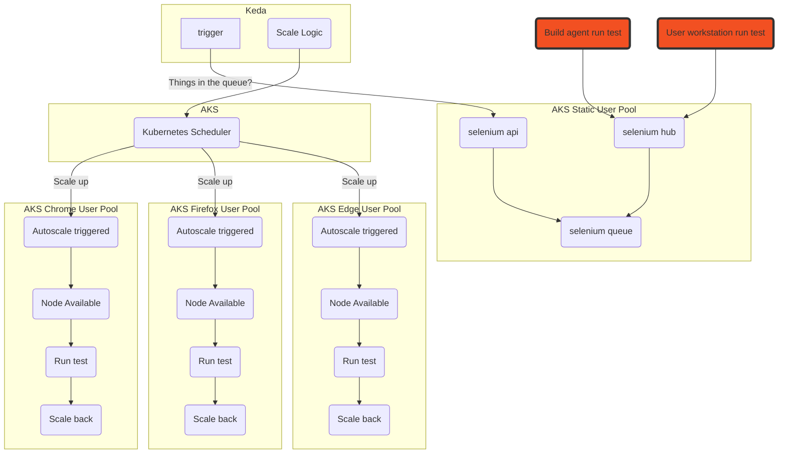

# Selenium Grid scaling with KEDA on AKS

This sample shows how to create an Azure Kubernetes Service optimised to work with Selenium Grid for node autoscaling. 
Dedicated browser node pools will scale up from zero instances using KEDA (Kubernetes Event-driven Autoscaling) which monitors the Selenium test queue.

`This sample is currently a work in progress`

## Features

This project framework provides the following features:

* Multiple AKS autoscaling node pools match to the Selenium node types using Node Selectors
* KEDA is leveraged to allow the pools to scale from zero based on the Selenium queue

## Process Overview



## Getting Started

### Prerequisites

Using [AKS Construction](https://github.com/Azure/Aks-Construction), we can quickly set up pair of AKS clusters in different virtual networks with connectivity between.
One cluster will run the Selenium Grid, and the other will run a sample application.

```bash
az deployment sub create -u https://github.com/Azure/AKS-Construction/releases/download/0.6.2/sample-peeredvnet-main.json -l WestEurope -p adminPrincipleId=$(az ad signed-in-user show --query objectId --out tsv)
az aks get-credentials -n aks-grid-stest -g rg-stest-selenium --overwrite-existing
```

This sample uses the Selenium IDE CLI (Selenium Side Runner) to add tests to the queue. This requires Node & Npm to be installed. A dev container and GitHub action are included in this repo to make this easier for users who don't have Node set up locally.

### Installation

#### Keda

Install Keda into a new Keda namespace.

```bash
helm repo add kedacore https://kedacore.github.io/charts
helm repo update
kubectl create namespace keda
helm install keda kedacore/keda --namespace keda
```

#### Selenium Grid

Installs Selenium Grid in the default Kubernetes namespace.

```bash
git clone https://github.com/seleniumhq/docker-selenium.git

chromeReplicas=0
firefoxReplicas=0
edgeReplicas=0
helm upgrade --install selenium-grid docker-selenium/chart/selenium-grid/. --set hub.serviceType=LoadBalancer,chromeNode.replicas=$chromeReplicas,firefoxNode.replicas=$firefoxReplicas,edgeNode.replicas=$edgeReplicas,chromeNode.nodeSelector.selbrowser=chromepool,firefoxNode.nodeSelector.selbrowser=firefoxpool,edgeNode.nodeSelector.selbrowser=edgepool
```

> Please note; The Selenium Dashboard is publicly exposed for ease of access, in most deployments this would not be public.

#### Keda Triggers

Configure KEDA to look at the Selenium Grid GraphQL endpoint. Note the fqdn includes the service name and namespace of the Selenium-Hub service.

> The URL value from kedaSeleniumTriggers.yml is : http://selenium-hub.default.svc.cluster.local:4444/graphql' If you have deployed Selenium to a different namespace then you will need to change this.

```bash
kubectl apply -f kedaSeleniumTriggers.yml
```

#### Selenium Side Runer

```bash
npm install -g selenium-side-runner
```

### Quickstart

Now that the Cluster is ready, we can load up some tests to the Selenium Grid.

1. Get the Public IP address the Selenium Hub is running on.

```bash
HUBPUBLICIP=$(kubectl get svc -l app=selenium-hub -o=jsonpath='{.items[0].status.loadBalancer.ingress[0].ip}')
echo "Selenium Grid is accessible here: http://$HUBPUBLICIP:4444"
```

2. Use the Selenium Side Runner CLI to send some basic tests to the Grid

```bash
echo Node $(node -v)
echo Npm $(npm -v)
echo Selenium side runner $(selenium-side-runner -V)

GridHubURL="http://$HUBPUBLICIP:4444"
PathToSeleniumTests="testsuites/basic/*"
selenium-side-runner --server $GridHubURL $PathToSeleniumTests --debug
```

## Demo

A demo app is included to show cross network connectivity, and more typical Selenium tests.

1. Install the Voting App On the other cluster

```bash

```

2. Grab the application IP

3. Run the application specific tests

```bash

```

## Cleanup

Two new resource groups will have been created in your subscription, these should be deleted.

```azurecli
az group delete -n rg-stest-selenium
az group delete -n rg-stest-testapp
```

## Resources

- https://github.com/seleniumhq/docker-selenium
- https://keda.sh/docs/2.6/scalers/selenium-grid-scaler/
- https://azure.github.io/AKS-Construction/
